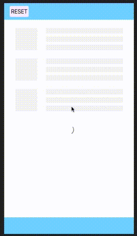

### 加载更多列表组件


#### GIF



### NPM
```shell
npm install load-more-list --save
```
```shell
yarn add load-more-list
```

### import
```js
import LoadMoreList from 'load-more-list';
export default {
  components:{ LoadMoreList }
}
```


### API
```javascript
export default {
  name: 'LoadMoreList',
  emits: ['load-more'], //加载更多事件
  props: {
    //是否有更多列表项
    hasMore: {
      type: Boolean,
      default: true,
    },
    //加载中
    loading: {
      type: Boolean,
      default: false,
    },
    //mount时自动加载
    loadOnMounted: {
      type: Boolean,
      default: true,
    },
    //加载的占位符
    skeletonCount: {
      type: Number,
      default: 3,
    },
    //触发加载时距离底部的距离
    bottomThreshold: {
      type: Number,
      default: 100,
    },
    //没有更多的文字
    noMoreText: String,
    //加载更多文字
    loadMoreText: String,
  },
}
```

### SLOTS

* skeleton 完全替换加载占位,默认包含`skeletonCount`个skeleton-item
  > props: 
  > * loading 是否加载中
* skeleton-item 占位item替换
   > props:
   > * 无
* footer 完全替换footer,默认包含`loading`,`no-more`,`load-more`三个插槽
  > props:
  > * hasMore 是否还有
  > * loading 是否加载中
  > * clickLoadMore 触发加载方法
* loading 替换loading
  > props:
  > * hasMore 是否还有
  > * loading 是否加载中
* no-more 替换no-more
  > props:
  > * hasMore 是否还有
  > * loading 是否加载中
* load-more 替换load-more
  > props:
  > * hasMore 是否还有
  > * loading 是否加载中
  > * clickLoadMore 触发加载方法
### Versions

#### 0.0.1: 
*  引入tailwindcss来处理样式
